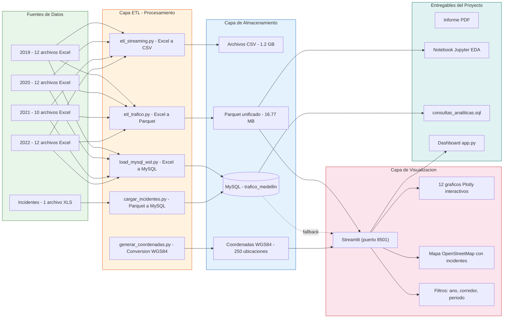

# Arquitectura del Proyecto - Analisis de Trafico Medellin 2019-2022



## Tecnologias Utilizadas

| Categoria | Herramientas |
|-----------|-------------|
| **Lenguaje** | Python 3.12 |
| **Librerias** | pandas, numpy, plotly, streamlit, sqlalchemy, pymysql, pyarrow, openpyxl, pyproj |
| **Base de datos** | MySQL 8.0 (WSL Ubuntu) |
| **Visualizacion** | Streamlit 1.58, Plotly 6.8, Mapbox OpenStreetMap |
| **Contenedor** | Docker (python:3.11-slim) |
| **Formatos** | Excel (.xlsx) -> CSV -> Parquet -> MySQL -> Dashboard |

## Flujo de Datos

```
Excel (46 archivos, 2.4 GB)
    |
    |-- etl_streaming.py --> CSV (~1.2 GB)
    |-- etl_trafico.py   --> Parquet (16.77 MB, 3.86M registros)
    |-- load_mysql_wsl.py --> MySQL (19.3M registros)
    |                          |-- trafico (24 columnas)
    |                          |-- incidentes (100K registros)
    |                          |-- zonas_criticas (238 registros)
    |
    v
Dashboard Streamlit
    |-- Modo principal: Parquet (rapido)
    |-- Fallback: MySQL
    |-- 12 visualizaciones + mapa interactivo + incidentes
```

## Base de Datos MySQL

```
trafico_medellin
    |-- trafico (19,343,072 registros)
    |   Columnas: id, carril, fecha, hora, dia_semana, mes, anio,
    |             velocidad_kmh, corredor, sentido, intensidad_veh_h,
    |             ocupacion, comuna, latitud, longitud, periodo_dia,
    |             es_hora_pico, indice_congestion
    |
    |-- incidentes (100,000 registros)
    |   Columnas: id, fecha_incidente, ubicacion, tipo_evento,
    |             gravedad, conteo_vehicular, velocidad_promedio
    |
    |-- zonas_criticas (238 registros)
        Columnas: corredor, comuna, velocidad_promedio,
                  intensidad_promedio, ocupacion_promedio
```
