# Arquitectura del Proyecto - Análisis de Tráfico Medellín 2019-2022

```mermaid
flowchart TB
    subgraph FUENTES["FUENTES DE DATOS"]
        EXCEL2019["📁 2019<br/>12 archivos Excel"]
        EXCEL2020["📁 2020<br/>12 archivos Excel"]
        EXCEL2021["📁 2021<br/>10 archivos Excel"]
        EXCEL2022["📁 2022<br/>12 archivos Excel"]
        EXCEL_INC["📁 Incidentes<br/>expanded_datos.xls"]
    end

    subgraph ETL["CAPA ETL - PROCESAMIENTO"]
        direction TB
        S1["etl_streaming.py<br/>🐍 Python + openpyxl<br/>Streaming Excel → CSV"]
        S2["etl_trafico.py<br/>🐍 Python + pandas<br/>Excel → Parquet (15% muestra)"]
        S3["load_mysql_wsl.py<br/>🐍 Python + SQLAlchemy<br/>Excel → MySQL + índices"]
        S4["generar_coordenadas.py<br/>🐍 Python + pyproj<br/>EPSG:3116 → WGS84"]
        S5["cargar_incidentes.py<br/>🐍 Python + pandas<br/>Parquet → MySQL"]
    end

    subgraph ALMACENAMIENTO["CAPA DE ALMACENAMIENTO"]
        direction TB
        CSV["📄 Archivos CSV<br/>trafico_20XX.csv<br/>~1.2 GB total"]
        PARQUET["📦 Archivos Parquet<br/>trafico_medellin_unificado.parquet<br/>16.77 MB"]
        MYSQL["🗄️ MySQL (WSL Ubuntu)<br/>trafico_medellin"]
        MYSQL_TABLES["├── trafico (19.3M registros)<br/>├── incidentes (100K registros)<br/>└── zonas_criticas (238 registros)"]
        COORD["📦 coordenadas_corredores.parquet<br/>250 ubicaciones WGS84"]
    end

    subgraph DASHBOARD["CAPA DE VISUALIZACIÓN"]
        direction TB
        STREAMLIT["🚀 Streamlit (puerto 8501)<br/>dashboard/app.py"]
        GRAFICOS["📊 Gráficos Plotly<br/>• Velocidad por hora<br/>• Congestión por corredor<br/>• Heatmap hora-día<br/>• Evolución anual<br/>• Estacionalidad mensual<br/>• Pronóstico lineal"]
        MAPA["🗺️ Mapa Interactivo<br/>• Puntos de medición<br/>• Incidentes superpuestos<br/>• Click → detalle + serie temporal"]
        INCIDENTES["🚨 Sección Incidentes<br/>• KPIs por tipo/gravedad<br/>• Mapa de incidentes<br/>• Cruce tráfico vs incidentes"]
        FILTROS["🎛️ Filtros<br/>• Año<br/>• Corredor<br/>• Período del día"]
    end

    subgraph HERRAMIENTAS["HERRAMIENTAS Y TECNOLOGÍAS"]
        LENGUAJES["🐍 Python 3.12"]
        LIBRERIAS["📚 Librerías<br/>pandas | numpy | plotly<br/>streamlit | sqlalchemy<br/>pymysql | pyarrow<br/>openpyxl | pyproj | fpdf2"]
        BD["💾 MySQL 8.0<br/>SQLAlchemy ORM"]
        CONTENEDOR["🐳 Docker<br/>python:3.11-slim"]
        WSL["🪟 WSL Ubuntu"]
        FORMATOS["📄 Formatos<br/>Excel (.xlsx) → CSV →<br/>Parquet (.parquet) →<br/>MySQL → Dashboard"]
    end

    subgraph ENTREGABLES["ENTREGABLES DEL PROYECTO"]
        PDF["📑 Informe PDF"]
        NOTEBOOK["📓 Jupyter Notebook<br/>EDA_Trafico_Medellin.ipynb"]
        SQL["💾 consultas_analiticas.sql"]
        DASH["🚀 Dashboard (app.py)"]
    end

    %% Conexiones ETL
    EXCEL2019 --> S1 & S2 & S3
    EXCEL2020 --> S1 & S2 & S3
    EXCEL2021 --> S1 & S2 & S3
    EXCEL2022 --> S1 & S2 & S3
    EXCEL_INC --> S5

    %% Flujo de datos ETL
    S1 --> CSV
    S2 --> PARQUET
    S3 --> MYSQL
    S4 --> COORD
    S5 --> MYSQL

    %% Consolidación Parquet
    PARQUET -->|"unifica"| PARQUET_FINAL["trafico_medellin_unificado.parquet<br/>16.77 MB - 3.86M registros"]

    %% Dashboard se conecta a fuentes
    PARQUET_FINAL --> STREAMLIT
    MYSQL -.->|"fallback"| STREAMLIT
    COORD --> STREAMLIT

    %% Dashboard contiene
    STREAMLIT --> GRAFICOS & MAPA & INCIDENTES & FILTROS

    %% Herramientas
    S1 & S2 & S3 & S4 & S5 --- LENGUAJES
    S1 & S2 & S3 & S4 & S5 --- LIBRERIAS
    MYSQL --- BD
    S3 --- WSL

    %% Entregables
    PARQUET_FINAL --> NOTEBOOK
    MYSQL --> SQL
    STREAMLIT --> DASH
    PDF -.->|"documenta"| S1 & S2 & S3 & MYSQL & STREAMLIT

    %% Estilos
    classDef fuente fill:#e8f5e9,stroke:#2e7d32,stroke-width:2px
    classDef etl fill:#fff3e0,stroke:#e65100,stroke-width:2px
    classDef storage fill:#e3f2fd,stroke:#1565c0,stroke-width:2px
    classDef dashboard fill:#fce4ec,stroke:#c62828,stroke-width:2px
    classDef tools fill:#f3e5f5,stroke:#6a1b9a,stroke-width:2px
    classDef entregables fill:#e0f2f1,stroke:#00695c,stroke-width:2px

    class EXCEL2019,EXCEL2020,EXCEL2021,EXCEL2022,EXCEL_INC fuente
    class S1,S2,S3,S4,S5 etl
    class CSV,PARQUET,PARQUET_FINAL,MYSQL,MYSQL_TABLES,COORD storage
    class STREAMLIT,GRAFICOS,MAPA,INCIDENTES,FILTROS dashboard
    class LENGUAJES,LIBRERIAS,BD,CONTENEDOR,WSL,FORMATOS tools
    class PDF,NOTEBOOK,SQL,DASH entregables
```

## Descripción del Flujo

### 1. Capa de Fuentes (Datos Crudos)
- **46 archivos Excel** distribuidos en carpetas por año (2019-2022)
- Cada archivo contiene ~500K registros de sensores vehiculares
- **1 archivo .xls** con datos expandidos de incidentes

### 2. Capa ETL (Procesamiento)
| Script | Función | Tecnología |
|--------|---------|------------|
| `etl_streaming.py` | Lectura streaming de Excel → CSV | openpyxl, csv |
| `etl_trafico.py` | Muestra 15% → Parquet con métricas derivadas | pandas, numpy, pyarrow |
| `load_mysql_wsl.py` | Carga masiva a MySQL con checkpointing | SQLAlchemy, pandas |
| `generar_coordenadas.py` | Conversión MAGNA→WGS84 | pyproj (EPSG:3116→4326) |
| `cargar_incidentes.py` | Carga de incidentes a MySQL | pandas, SQLAlchemy |

### 3. Capa de Almacenamiento
- **MySQL**: 19.3M registros tablas `trafico` + 100K `incidentes` + 238 `zonas_criticas`
- **Parquet**: Dataset unificado de 3.86M registros (15% muestra), 16.77 MB
- **Coordenadas**: Mapping de 250 ubicaciones convertidas a WGS84

### 4. Capa de Visualización (Dashboard)
- **Streamlit** en puerto 8501
- **Plotly** para gráficos interactivos
- **Mapbox** OpenStreetMap para visualización geoespacial
- Modo dual: carga prioritaria desde Parquet, fallback a MySQL

### 5. Entregables Finales
- Dashboard funcional
- Notebook Jupyter con EDA
- Consultas SQL analíticas
- Informe PDF completo
